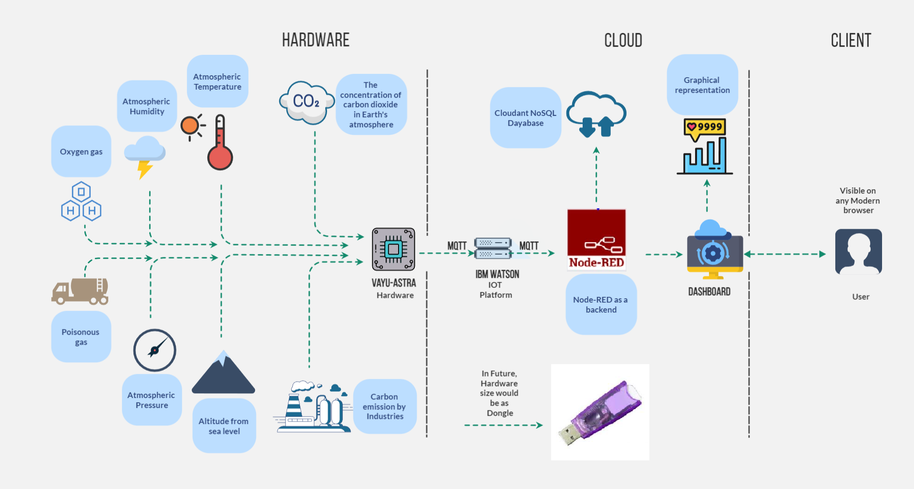
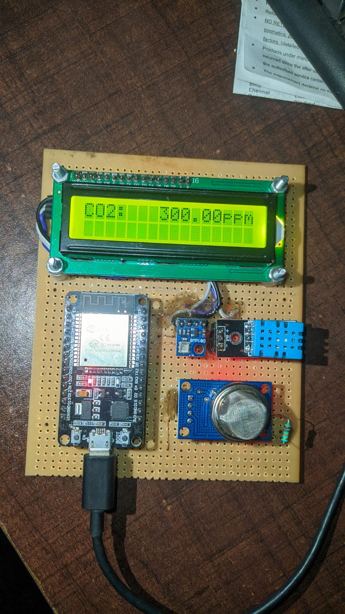

# Vayu Astra

  

A basic GitHub repository example for new [Call for Code](https://developer.ibm.com/callforcode/) projects and those that join the Call for Code with The Linux Foundation deployment initiative. Not all sections or files are required. You can make this as simple or as in-depth as you need. And don't forget to [join the Call for Code community](https://developer.ibm.com/callforcode/solutions/projects/get-started/).

> If you're new to open source, please consider taking the [free "Introduction to Open Source" class](https://cognitiveclass.ai/courses/introduction-to-open-source).
> 
> 

_Read this in other languages: [English](README.md), [한국어](./docs/README.ko.md), [português](./docs/README.pt_br.md), [中文](./docs/README.zh.md)._ 

## Contents

- [Submission or project name](#submission-or-project-name)
  - [Contents](#contents)
  - [Short description](#short-description)
    - [What's the problem?](#whats-the-problem)
    - [How can technology help?](#how-can-technology-help)
    - [The idea](#the-idea)
  - [Demo video](#demo-video)
  - [The architecture](#the-architecture)
  - [Long description](#long-description)
  - [Project roadmap](#project-roadmap)
  - [Getting started](#getting-started)
  - [Live demo](#live-demo)
  - [Built with](#built-with)
  - [Contributing](#contributing)
  - [Versioning](#versioning)
  - [Authors](#authors)
  - [License](#license)
  - [Acknowledgments](#acknowledgments)

## Short description

### What's the problem?

Are you aware that Air Pollution is the cause of 6·5 million deaths each year globally? It attributes 11.65% death every year. It not only takes away people's life but also largely affects on the quality of living. 
Carbon emissions cause climate change by trapping heat, and impact public health adversely - inhalation of high concentrations of CO2 directly harms people's respiratory system, causing breathlessness, headache , chest pains and even cardiovascular diseases.

### How can technology help?

We want to combine technology + motive + idea to design a system for air quality monitoring and its communication about the degradation of air, which will tell us amount of CO2 in air, along with oxygen levels, thanks to  IBM IoT services, this platform helped us to make our task easier. Along with monitoring CO2 , Oxygen, and dangerous gases levels, Vayu Astra will help user in detecting carbon emission pollution hotspot and will alert user regarding by sending them notification......
Idea is to deploy large number of low cost device across geographic location to collect respective data, analyse it with help of cloud platform and send this data to user and respective authorities so they can take actions regarding it.

### The idea
1) Predicts amount of CO2 in air as CO2 levels increase it will give notification to user
2) When there's any poisonous gas present in surrounding it will alert user about it by sending notification. 
4) If government authorities are using vayu astra..on dashboard they can see respective data regarding CO2 oxygen levels and other harmful gases..if any particular area as soon as CO2 emissions will increase they give it information about it and it will become easier for them to recognise that area..and take respective strict actions to  factors which are contributing to it .
5) If a user is traveling somehow it will give them alert about pollution hotspot, so they can carry respective preventive measures.

## Demo video

[

## The architecture

1) Vayu Astra hardware consists of low power, internet enabled setup that monitors air parameters ( CO2, oxygen levels, humidity, poisonous gases, temperature altitude etc) and sends it to IBM  Watson lot platform via MQTT
2) The node RED backend IBM cloud collects these parameters via MQTT
3) Once evaluation is done it stores the data instance on cloud database and sends the air quality information to the IBM dashboard for visual indication
4) In case if there's increase amount of CO2, less oxygen levels in surroundings, or if any poisonous gas is present in surrounding the node red backend sends a text message to subscribed user and  they can see the data on respective dashboard
5) The node RED backend sets up a websocket service for data transmission to vayu astra dashboard
6) Vayu Astra dashboard then displays data in number, chart, maps, air quality estimation etc
7) In any case hardware disconnects from internet it is capable to approximately asses the air quality and display through 16x2 LCD indicator

## Long description

The project currently does the following things.

## Getting started
In this project we designed  a hardware which measures and analyses atmospheric temperature , humidity , pressure , altitude from sea level and Carbon percentage in air . all these datas are captured by the hardware and  sent to IBM cloud server using MQTT protocol , a messaging protocol for IoT. 

## Hardware 
So coming to the hardware part we have used a couple of sensors and a microcontroller . The sensor we used here are DHT11 for sensing atmospheric  humidity and temperature , for pressure and altitude from sea level BMP 180 ,for Carbon percentage in air -  MQ135 . All these sensors are connected to our main controller which is ESP32 . And for data representation we have used a 16x2  LCD display , along with a I2C module which enables the device to communicate in a stable way. Rest of the sensors are driven by a program , for which we installed libraries in  program through which we can access the data and sense it .  
Using MQTT publish subscribe architecture we are sending data to server. We also designed a PCB . We used a Zero PCB circuit board . The Perfboard was mounted and traced and designed. So the hardware is sensing the data , then sending the data to server. This is the hardware part .

## Server
Now the server part , what we have done is , we logged in to our IBM cloud , then created resources, then added our device in IoT platform , got our unique MAC address/ device ID . As of now we are using only one device but we can use multiple devices with their unique MAC address device ID , each linking to a particular geographical address of the device.
Since it's a free plan we can only add one device. After adding our device, coming to the dashboard, we created cards , for representing data visually through bars graph ,linear graphs , pie charts etc .

## Data Configuration
Now we have to configure the data our hardware is sending . In MQTT protocol publish subscribe architecture, there is a publisher and a subscriber , and a node is created between them where the data is stored .
Here our hardware is the publisher and the IBM IoT platform is the subscriber . A topic is created in hardware, let's say humidity, now the number of parameters will determine the number of topics created separately. For every topic created a node is sent , in our case we used 'Status' . Now after configuration, when I turn on my hardware ESP32 and it is connected to WiFi, it will start publishing data and it will be shown on my IBM IoT platform.
Now all the parameters and the datas will start showing  on IoT platform. Any changes to the parameters will be sensed correctly and shown accordingly on the dashboard  as well .

## Roadmap
In future we are planning to make use of multiple Vayu Astra at different locations and make a network wokring hand to hand with authorities concerned with taking actions for better air quality . We also are planning to minimize current hardware setup into a portable, handy user friendly dongle .

## Built with

- [IBM Cloudant](https://cloud.ibm.com/catalog?search=cloudant#search_results) - The NoSQL database used
- [IBM Cloud Functions](https://cloud.ibm.com/catalog?search=cloud%20functions#search_results) - The compute platform for handing logic

## live demo 
http://169.51.200.215:32414/ui
https://drive.google.com/file/d/1R2dShqkPmLtq-fOzo-eTJIWD-gPvRQXa/view?usp=drivesdk 

## Authors

- **Billie Thompson** - _Initial work_ - [PurpleBooth](https://github.com/PurpleBooth)

## License

This project is licensed under the Apache 2 License - see the [LICENSE](LICENSE) file for details.

## Acknowledgments

- Based on [Billie Thompson's README template](https://gist.github.com/PurpleBooth/109311bb0361f32d87a2).
